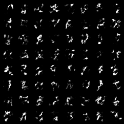
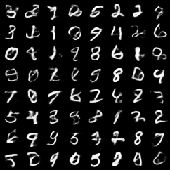
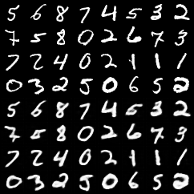
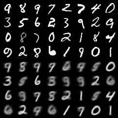

# VAE VQVAE training

## VAE sampling

Images show 64 new samples generated using VAEs with two different architectures

## VQVAE reconstructions

Images show
 - first 4 rows original MNIST test data
 - second 4 rows reconstructions of the above MNIST test data